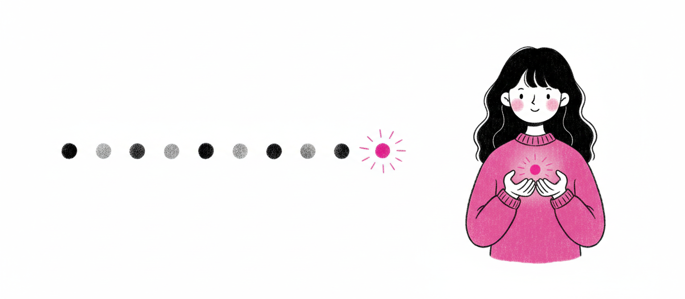
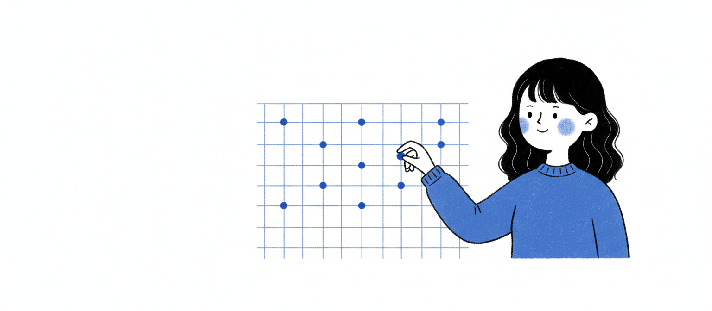

<div align="center">


# Power Design

### A Claude skill for decks *and* websites that don't look like AI made them.

**Brand DNA × codified design principles → beautiful HTML, on demand. 20 rules for slides, 20 for the web.**

[**See the principles →**](https://power-design.vercel.app) ·
[**Join the community →**](https://bit.ly/3PATPoL)

</div>

---

## What it does

Power Design is a Claude Code skill that makes **two kinds of output** — presentation decks *and* full responsive websites — combining two things every other AI generator misses:

1. **Brand DNA** — extracted live from any URL via Firecrawl, or picked from **72+ pre-built brand systems** (Stripe, Apple, Linear, Spotify, Vercel, Notion, Tesla, Airbnb…)
2. **Codified design principles** — research-backed rules with numeric thresholds. **20 for slides** (Tufte, Reynolds, Duarte, Williams, Refactoring UI, Müller-Brockmann, Mayer, WCAG 2.2) and **20 for the web** (Marcotte, Krug, Bringhurst, Utopia, Baymard, NN/g, Core Web Vitals, WCAG 2.2).

The result: every output is both on-brand and objectively well-designed. Decks with no purple gradients, no six-bullet heroes, no drop-shadowed bars. Websites that are mobile-first, fast (Core Web Vitals-budgeted), accessible (WCAG 2.2 AA), and built to convert.

**One skill, two paths.** It asks *"deck or website?"* first, then routes to the right rulebook off the same brand engine.

---

## The 20 slide rules, illustrated

Every slide passes the same 20 checks. **[Read the full field manual →](https://power-design.vercel.app)**

<div align="center">

   
   
   
   
   

</div>

| # | Rule | Source |
|---:|---|---|
|  1 | One idea per slide | Reynolds; Duarte |
|  2 | Glanceable in ≤3 seconds | Duarte; NN/g |
|  3 | ≤7±2 visual chunks; ideal 3–5 | Miller 1956; Cowan 2001 |
|  4 | ≥40% whitespace ratio | Refactoring UI; Reynolds |
|  5 | 5% edge safe-zone, all sides | Broadcast title-safe |
|  6 | Type on a modular scale (1.25–1.618) | Tschichold; Bringhurst |
|  7 | Maximum 4 type sizes per slide | Refactoring UI |
|  8 | Body ≥24px, title ≥48px | Reynolds; Duarte |
|  9 | Line-height 1.4–1.6 body, 1.05–1.2 display | Butterick; Bringhurst |
| 10 | Line length ≤60 characters | Bringhurst |
| 11 | WCAG contrast ≥4.5:1 body, aim 7:1 (AAA) | WCAG 2.2 |
| 12 | 60-30-10 color split | Itten; Refactoring UI |
| 13 | One accent per slide | Tufte |
| 14 | Never encode meaning by hue alone | WCAG 1.4.1 |
| 15 | 8pt grid for all spacing | Bryn Jackson; Material |
| 16 | Align everything to one grid | Müller-Brockmann |
| 17 | Proximity: related ≤16px, unrelated ≥48px | Gestalt; Williams |
| 18 | Data-ink ratio ≥80% | Tufte 1983 |
| 19 | F-pattern: headline + key visual top-left | NN/g eye-tracking |
| 20 | Two valid modes — pick one and stay | Tufte vs Reynolds |

---

## The 20 web rules

A slide is a fixed frame. A page is a fluid, interactive, indexable *system* — so websites pass a second rulebook, built for the four questions a slide never has to answer: **does it hold up from 360px to 1440px, is it fast, can everyone use it, does it convert?** **[Read the full ruleset →](principles/web-principles.md)**

| # | Rule | Source |
|---:|---|---|
|  1 | Mobile-first, fluid to a capped measure | Marcotte; Frost |
|  2 | Breakpoints follow content, not devices | Frost; Tailwind |
|  3 | Fluid type & space via `clamp()` | Utopia — Mudford & Gilyead |
|  4 | Body ≥16px; tap targets ≥44×44px | Apple HIG; WCAG 2.5.8 |
|  5 | One primary action per view | Krug; Hick's Law |
|  6 | The fold answers what/who/next in 5s | NN/g; Krug |
|  7 | F-scan text, Z-scan heroes; left-align body | NN/g; Butterick |
|  8 | Measure 45–75 characters | Bringhurst; Butterick |
|  9 | Line-height ≥1.5 body; rhythm on 8 | WCAG 1.4.12; Bringhurst |
| 10 | 8pt spacing, one modular type scale | Material; Bryn Jackson |
| 11 | WCAG 2.2 AA is the floor (UI/focus ≥3:1) | WCAG 2.2 |
| 12 | Semantic OKLCH color tokens, not raw hex | W3C DTCG; Ottosson |
| 13 | Five states per interactive element | WCAG 2.4.11/13; Radix |
| 14 | Design empty, loading & error states | NN/g; Refactoring UI |
| 15 | Motion fast, purposeful, opt-out | Material; WCAG 2.3.3 |
| 16 | Reserve space — protect CLS < 0.1 | web.dev Core Web Vitals |
| 17 | Ship a performance budget (LCP/INP/CLS) | web.dev; Google 2024 |
| 18 | Landmarked, keyboard-complete, one `<h1>` | WCAG 1.3.1 / 2.4.1 |
| 19 | Forms: labels, inline validation, min fields | Baymard; NN/g |
| 20 | Ship the meta layer (title / OG / JSON-LD) | Open Graph; schema.org |

> For the **build stack** behind modern web output — design tokens, shadcn/ui, Tailwind v4, Radix, OKLCH, motion, theming — see the sister repo **[power-design-web](https://github.com/ItsssssJack/power-design-web)**.

---

## Install

```bash
git clone https://github.com/ItsssssJack/power-design ~/.claude/skills/power-design
```

Then in Claude Code:

```
> use power-design — make me a deck for stripe.com about our new product launch
> use power-design — build me a landing page in linear.com's style for my new app
```

The skill will:
1. Ask **deck or website?**, then which brand (paste URL, pick from library, or skip for default)
2. Extract brand DNA via Firecrawl (~30 seconds)
3. Ask a short brief (deck: headline + 3–5 points · site: type, goal, sections)
4. Generate `slides.html` **or** a responsive `site.html`, applying brand DNA × the right 20 rules
5. Open in browser. Refine via natural conversation.

---

## Brand library — 72 pre-built systems

| Tech / AI | Finance | Auto / Lifestyle | Media | Productivity |
|---|---|---|---|---|
| Anthropic / Claude · OpenAI · DeepSeek · Linear · Vercel · Stripe · Cursor · GitHub · Figma · Webflow · Framer · Mintlify · Notion · Raycast · Lovable · Resend · Sentry · Supabase · Superhuman · MongoDB · Sanity · Posthog · Replicate · Runway · Hashicorp · ElevenLabs · Cal · Clay · Composio · ClickHouse · Cohere · Mistral · Together · x.ai · Ollama · OpenCode · Expo · Pinterest · Glaido | Stripe · Mastercard · Coinbase · Binance · Kraken · Revolut · Wise · Shopify | Tesla · BMW · BMW M · Bugatti · Ferrari · Lamborghini · Renault · Nike · Airbnb · Apple · Starbucks · Grind · Vodafone | The Verge · Wired · Spotify · YouTube · Sony · PlayStation · IBM | Notion · Slack · Miro · Intercom · Zapier · Uber · NVIDIA · SpaceX · VoltAgent · Warp |

Each entry is a single `brand-style.md` file: colors, type, voice, components, source URL. Add your own using `brands/_template.md`.

---

## How the skill works (under the hood)

```
   ┌────────────────────────────────────────────────┐
   │  0. Deck or website?    → routes the rulebook  │
   ├────────────────────────────────────────────────┤
   │  1. Brand DNA           (URL → Firecrawl)      │
   │     OR pick from        brands/<name>.md        │
   ├────────────────────────────────────────────────┤
   │  2. Design rules        design-principles.md   │
   │                         OR web-principles.md   │
   ├────────────────────────────────────────────────┤
   │  3. Compose             brand × rules → HTML    │
   └────────────────────────────────────────────────┘
                       ↓
              slides.html  ·  site.html
```

The skill's runbook lives in `SKILL.md`. The design principles — with research citations and numeric thresholds — live in `principles/design-principles.md` (slides) and `principles/web-principles.md` (web).

---

## Credits

- **Brand library** — forked and restructured from [VoltAgent/awesome-design-md](https://github.com/VoltAgent/awesome-design-md), with permission and credit.
- **Design research (slides)** — Edward Tufte, Garr Reynolds, Nancy Duarte, Robin Williams (CRAP), Adam Wathan & Steve Schoger (Refactoring UI), Josef Müller-Brockmann, Matthew Butterick, Robert Bringhurst, Richard Mayer, Nielsen Norman Group, WCAG 2.2.
- **Design research (web)** — Ethan Marcotte, Luke Wroblewski, Brad Frost, Steve Krug, Utopia (Trys Mudford & James Gilyead), Björn Ottosson (OKLCH), Baymard Institute, Nielsen Norman Group, Google Core Web Vitals, W3C WCAG 2.2 & Design Tokens CG.
- **Illustrations** — generated via Kie.ai nano-banana 2.

---

## License

MIT — see [LICENSE](LICENSE).

---

<div align="center">

**Built by Jack Roberts** ·
[**Vercel showcase**](https://power-design.vercel.app) ·
[**Community**](https://bit.ly/3PATPoL)

</div>
